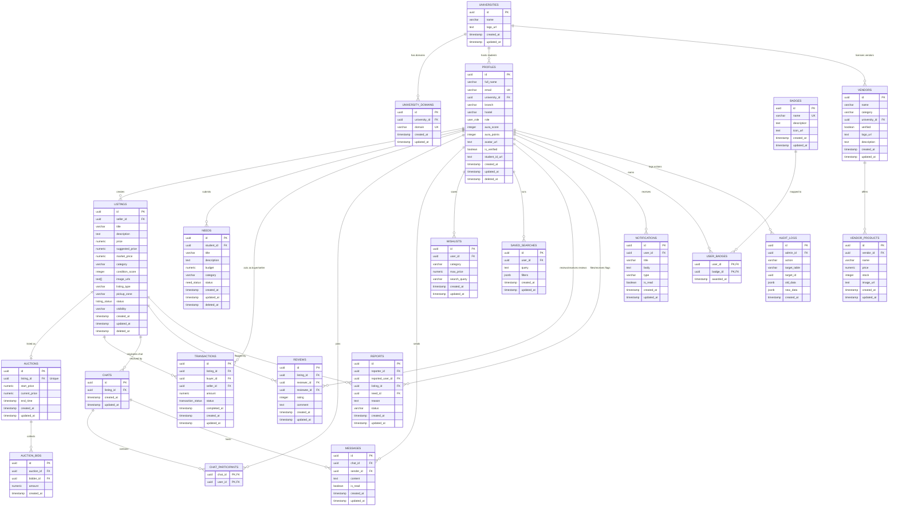

# NeedAura - Entity-Relationship (ER) Diagram

This document contains the visual map of database entities, schemas, and relationships for the NeedAura student super app.

```mermaid
erDiagram
    UNIVERSITIES {
        uuid id PK
        varchar name
        text logo_url
        timestamp created_at
        timestamp updated_at
    }

    UNIVERSITY_DOMAINS {
        uuid id PK
        uuid university_id FK
        varchar domain UK
        timestamp created_at
        timestamp updated_at
    }

    PROFILES {
        uuid id PK
        varchar full_name
        varchar email UK
        uuid university_id FK
        varchar branch
        varchar hostel
        user_role role
        integer aura_score
        integer aura_points
        text avatar_url
        boolean is_verified
        text student_id_url
        timestamp created_at
        timestamp updated_at
        timestamp deleted_at
    }

    LISTINGS {
        uuid id PK
        uuid seller_id FK
        varchar title
        text description
        numeric price
        numeric suggested_price
        numeric market_price
        varchar category
        integer condition_score
        text[] image_urls
        varchar listing_type
        varchar pickup_zone
        listing_status status
        varchar visibility
        timestamp created_at
        timestamp updated_at
        timestamp deleted_at
    }

    AUCTIONS {
        uuid id PK
        uuid listing_id FK "Unique"
        numeric start_price
        numeric current_price
        timestamp end_time
        timestamp created_at
        timestamp updated_at
    }

    AUCTION_BIDS {
        uuid id PK
        uuid auction_id FK
        uuid bidder_id FK
        numeric amount
        timestamp created_at
    }

    NEEDS {
        uuid id PK
        uuid student_id FK
        varchar title
        text description
        numeric budget
        varchar category
        need_status status
        timestamp created_at
        timestamp updated_at
        timestamp deleted_at
    }

    TRANSACTIONS {
        uuid id PK
        uuid listing_id FK
        uuid buyer_id FK
        uuid seller_id FK
        numeric amount
        transaction_status status
        timestamp completed_at
        timestamp created_at
        timestamp updated_at
    }

    CHATS {
        uuid id PK
        uuid listing_id FK
        timestamp created_at
        timestamp updated_at
    }

    CHAT_PARTICIPANTS {
        uuid chat_id PK, FK
        uuid user_id PK, FK
    }

    MESSAGES {
        uuid id PK
        uuid chat_id FK
        uuid sender_id FK
        text content
        boolean is_read
        timestamp created_at
        timestamp updated_at
    }

    WISHLISTS {
        uuid id PK
        uuid user_id FK
        varchar category
        numeric max_price
        varchar search_query
        timestamp created_at
        timestamp updated_at
    }

    SAVED_SEARCHES {
        uuid id PK
        uuid user_id FK
        text query
        jsonb filters
        timestamp created_at
        timestamp updated_at
    }

    REVIEWS {
        uuid id PK
        uuid listing_id FK
        uuid reviewer_id FK
        uuid reviewee_id FK
        integer rating
        text comment
        timestamp created_at
        timestamp updated_at
    }

    REPORTS {
        uuid id PK
        uuid reporter_id FK
        uuid reported_user_id FK
        uuid listing_id FK
        uuid need_id FK
        text reason
        varchar status
        timestamp created_at
        timestamp updated_at
    }

    NOTIFICATIONS {
        uuid id PK
        uuid user_id FK
        varchar title
        text body
        varchar type
        boolean is_read
        timestamp created_at
        timestamp updated_at
    }

    BADGES {
        uuid id PK
        varchar name UK
        text description
        text icon_url
        timestamp created_at
        timestamp updated_at
    }

    USER_BADGES {
        uuid user_id PK, FK
        uuid badge_id PK, FK
        timestamp awarded_at
    }

    VENDORS {
        uuid id PK
        varchar name
        varchar category
        uuid university_id FK
        boolean verified
        text logo_url
        text description
        timestamp created_at
        timestamp updated_at
    }

    VENDOR_PRODUCTS {
        uuid id PK
        uuid vendor_id FK
        varchar name
        numeric price
        integer stock
        text image_url
        timestamp created_at
        timestamp updated_at
    }

    AUDIT_LOGS {
        uuid id PK
        uuid admin_id FK
        varchar action
        varchar target_table
        uuid target_id
        jsonb old_data
        jsonb new_data
        timestamp created_at
    }

    UNIVERSITIES ||--o{ UNIVERSITY_DOMAINS : "has domains"
    UNIVERSITIES ||--o{ PROFILES : "hosts students"
    UNIVERSITIES ||--o{ VENDORS : "licenses vendors"
    
    PROFILES ||--o{ LISTINGS : "creates"
    PROFILES ||--o{ NEEDS : "submits"
    PROFILES ||--o{ TRANSACTIONS : "acts as buyer/seller"
    PROFILES ||--o{ CHAT_PARTICIPANTS : "joins"
    PROFILES ||--o{ MESSAGES : "sends"
    PROFILES ||--o{ WISHLISTS : "saves"
    PROFILES ||--o{ SAVED_SEARCHES : "runs"
    PROFILES ||--o{ REVIEWS : "reviews/receives reviews"
    PROFILES ||--o{ REPORTS : "files/receives flags"
    PROFILES ||--o{ NOTIFICATIONS : "receives"
    PROFILES ||--o{ USER_BADGES : "earns"
    PROFILES ||--o{ AUDIT_LOGS : "logs actions"

    LISTINGS ||--o| AUCTIONS : "listed as"
    LISTINGS ||--o{ TRANSACTIONS : "resolved by"
    LISTINGS ||--o{ CHATS : "originates chat"
    LISTINGS ||--o{ REVIEWS : "referenced by"
    LISTINGS ||--o{ REPORTS : "flagged by"

    AUCTIONS ||--o{ AUCTION_BIDS : "collects"

    CHATS ||--o{ CHAT_PARTICIPANTS : "contains"
    CHATS ||--o{ MESSAGES : "hosts"

    VENDORS ||--o{ VENDOR_PRODUCTS : "offers"

    BADGES ||--o{ USER_BADGES : "mapped to"
```
